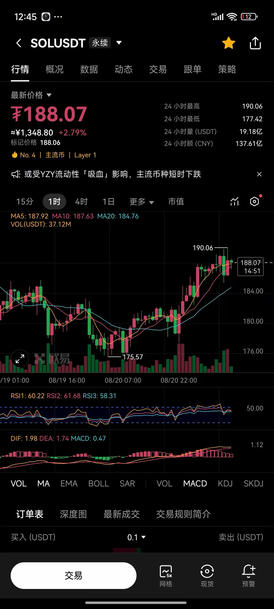
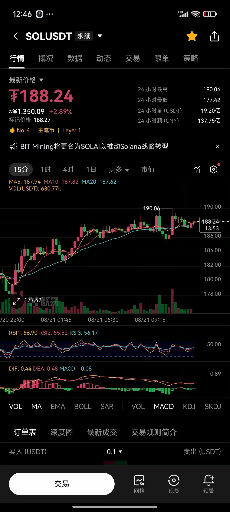

2025-08-21 周四
## 1. 近期是否有大事？
2025-08-22 22点鲍威尔讲话
## 2. 美股情况如何？
前一日是中跌
## 3. SOL实战记录

1. 开仓理由
- SOL日线死叉状态，BTC日线也是死叉状态，整体市场处于回调阶段。
- 4小时k线虽然处于金叉。 小时线MA5趋于平缓，即将与MA10交汇形成死叉。 15分钟线也是即将形成死叉。
- 190阻力位，3小时前冲高189.9回落，2小时前冲到190.06回落。 有上影线也有量。
2. 开仓点位

188.1开空，±3%止盈止损。

止盈182.45，止损193.74。
3. 结果

改止盈线至182.56，最低点182.76，反弹至184.41因临近美股开盘有不确定性手动平仓，最终只盈利2%，最低点距离目标已十分接近。

