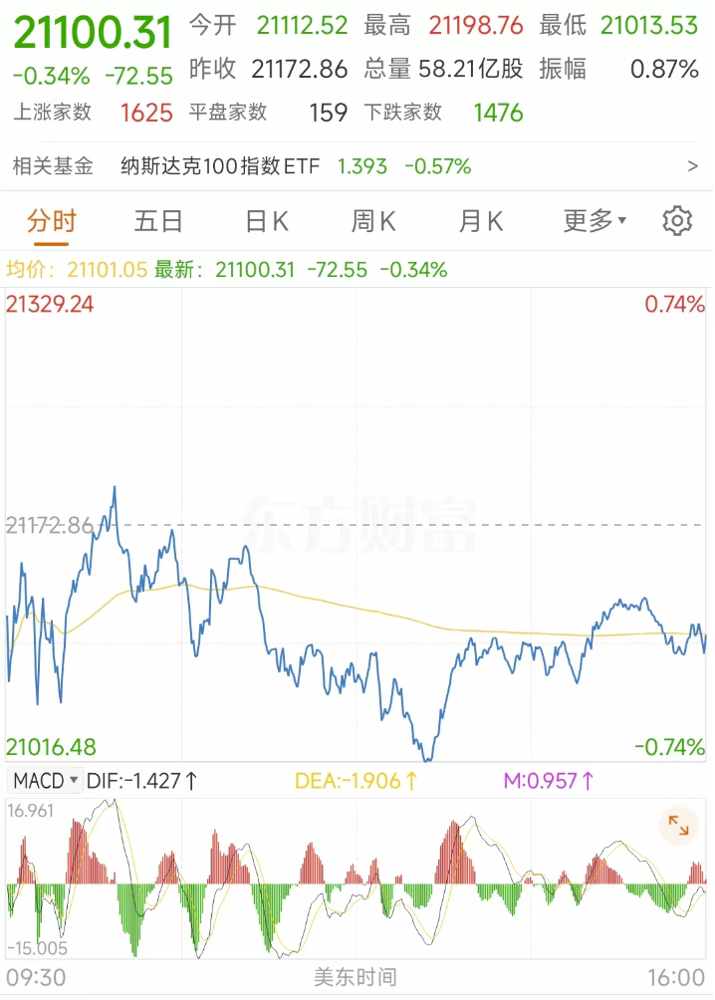

2025-08-22 周五
## 1. 是否有大事？
22点鲍威尔讲话
## 2. 美股情况如何？
前一日美股低开【-0.3%】，一度跌到【-0.74%】，最后反弹至【-0.34%】

## 3. 记录白天的的一个行情
没有开仓，但是对于SOL在的小时线金叉上涨进行记录
1. 金叉
8:00的时候，SOL的小时线形成金叉。
2. MA5线
在3:00-8:00的MA5线趋于平缓
3. 180支撑位
前一日从190跌至180附近，数小时的观察形成支撑位。
- 1:00-min-179.78；
- 3:00-min-179.83；
- 4:00-min-179.28；
- 7:00-min-179.28；
- 8:00-min-179.72；
- 9:00-min-179.89；
4. 大饼情况
MA5在4:00-8:00趋于平缓，并在8:00形成小金叉
5. 如果能重来

15分钟线的MA在8:15往上，即将形成金叉，结合小时线的平金叉与支撑位，美股尾声是反弹，可以尝试小量。虽然4h和日线都是死叉，但是我只想博1-2%的轻微反弹。
按此方式思考大约会在8:15-9:00开仓，价格是180.66-181.7。
止损放在178.98，止盈放在184.43，按照中位数181.18开仓价计算的话。
- 止损2.20，亏损率1.21%
- 止盈3.25，盈利率1.79%
- 盈亏比1:48

最后在16:00的最高点185之前止盈

## 5. 鲍威尔讲话记录
美股在21:30小红开，鲍威尔22:00开始讲话，因其鸽派发言点燃了市场的乐观情绪。
1. 加密货币上涨
- ETH和SOL从一路涨了10%+
- BTC涨了3%+
2. 美股+1.88%收盘
3. 如果能重来
临近降息前的讲话，对ETH或者SOL在讲话前开仓，低倍杠杆设置2.5%止损，5%止盈。盈亏比是2。
2.5%是留一个波动空间，5%才是猜方向，如果情绪特别火爆，再调整止盈方向。
猜对了涨5%，猜错了亏2.5%

