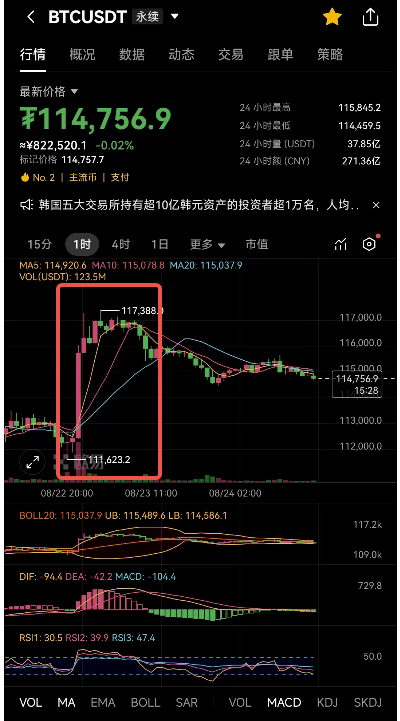
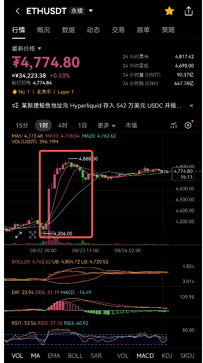
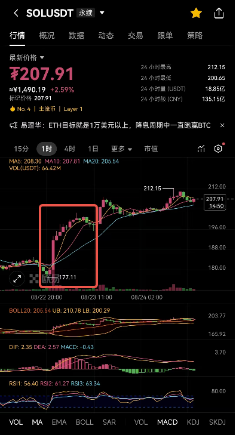
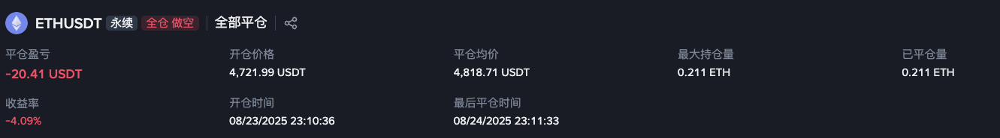

2025-08-23 周六
## 1. 近期是否有大事？
昨晚22:00鲍威尔讲话释放鸽派信号，市场情绪乐观
## 2. 美股情况如何？
昨夜美股冲高【+1.88%】收盘
## 3. 记录小时线冲高回落形态
1. BTC在5:00-8:00的时候MA5趋于平缓，形成平顶，随后回落形成死叉，在8-10点有回调形态。涨4.4%，回调1.7%。9-10点有1.2%的回调。
2. ETH在5:00-8:00的时候MA5趋于平缓，形成平顶，随后回落形成死叉，在8-10点有回调形态。涨14%，回调5%。9-10点有3%的回调。
3. SOL在5:00-8:00的时候MA5趋于平缓，形成平顶，随后回落形成死叉，在8-10点有回调形态。涨12%，回调3.6%。9-10点有1.7%的回调。
4. 但是SOL可能因其他原因，落掉幅度有限，在10点后继续冲高，与BTC、ETH走出不同的行情。

## 4. 总结
因消息面的利好，在冲高后必然会有回落，参考小时线MA5，趋于平缓之后就是回调的征兆。
近日交易量都在ETH上，首选ETH吃回调，吃2%。
如果是BTC吃1%即可。
选到SOL按理来说想吃2%-3%，选到反而会被止损，只能自认倒霉。

## 5.盲目交易了一单
在23:10:36的时候还是忍不住开了一单空。开单理由是白天冲高回落，会继续跌，因此设置止盈止损上下两个点。

没有任何k线数据可以支撑我的开单理由，纯粹是赌一把。赌输了。

一开始的初心还是周末两天观望，还是忍不住了。

次日晚上eth继续冲高，突破新高至4958.69，距离我的开仓点位涨了5%。

带单的第一单，2倍杠杆的2%，亏损4%。
