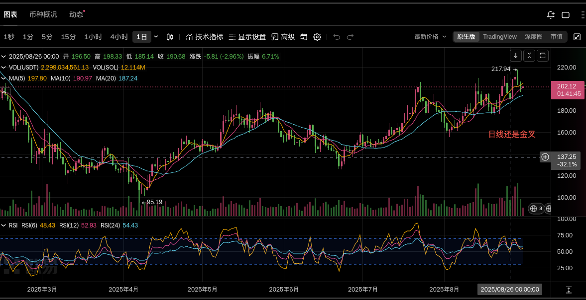

2025-08-26 周二
## 1. 近期是否有大事？
无
## 2. 美股情况如何？
在上周五的降息大暴涨【+1.88%】后，冲高不成，收盘微跌【-0.22%】。
## 3. 开单记录
15:09:29，参考前面的横盘以及前两天一单190压力位，在187.99开空3倍空，上下3%。
主观认为SOL不配在这个位置上涨。
最后结果在192手动平仓，亏损6.43%。
从日线到15分钟线的k线分析。
- 日线：金叉状态
- 4h：死叉了几个k线
- 1h：平金叉，隐隐要上拐
- 15min：乱七八糟横盘，没有参考意义。

主观看跌，再赌美股今晚还会跌，因为周一的回调远远低于上周五的涨幅。
## 4. 总结
这个k线反而是185形成支撑位，15分钟线模糊不定，1h线在死叉后已经有两次大跌了。4h的死叉也持续了6个k线，6连阴。
日线金叉看不出什么。

从最高213.69，一路跌到185.14，跌幅已经有13+%。

SOL这样的大币，回调应该是健康的，哪怕是熊来了也是在回调中伴随着无数反弹。

我不应该在这个情况下还去做空，此时胜率已经很小了，我应该博一下反弹。