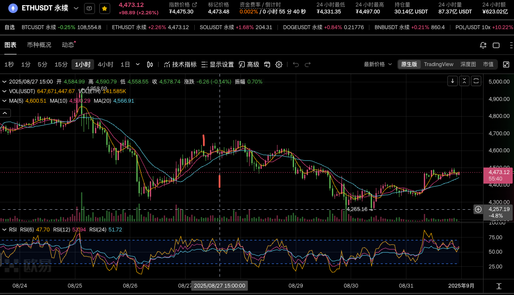
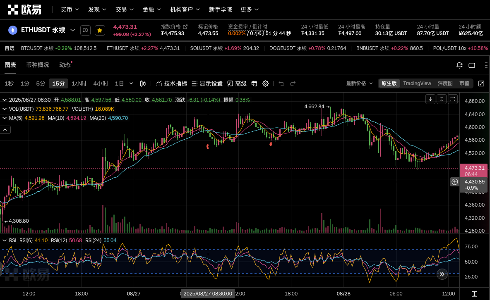

2025-08-27 周三
## 1. 近期是否有大事？
无
## 2. 美股情况如何？
前一日微涨【+0.44%】
## 3. 开单记录（第一单）
起床后看到小时线开始下拐，并且15分钟线刚刚出现死叉，果断开空。在下午手动平掉。不赚不亏。
1. 开单理由：
- 1h：小顶
- 15min：刚刚出现死叉

2. 平仓理由：
4587开空，最低到4538，跌幅1%，随后最高到4625，涨幅0.8%。
后续几个小时1h线的MA5和MA10纠缠不清，横盘僵局。就找个点位跑了。

## 4. 开单记录（第二单）

太久了，依稀记得是在4600上下焦灼了几个小时，本着大背景回调的思路，4580开空，没有设置止损。
次日凌晨最低跌到4466，一路看着他反弹回成本线止损。
