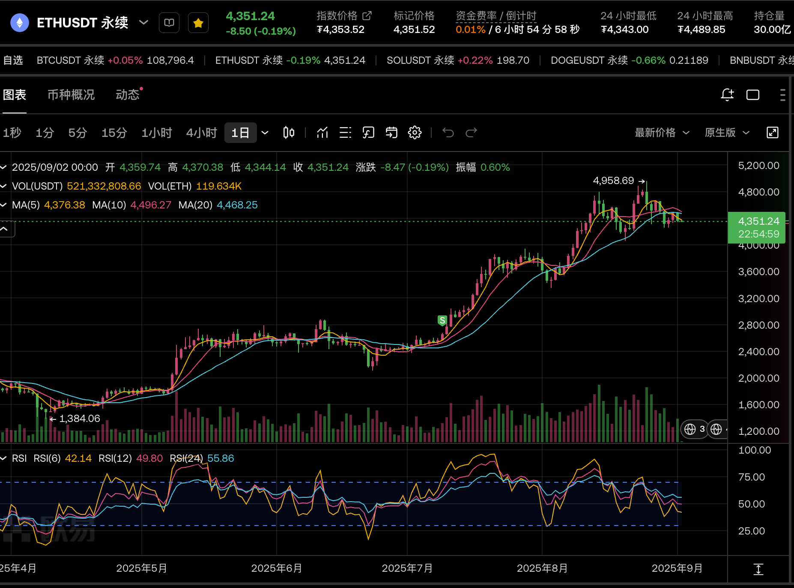
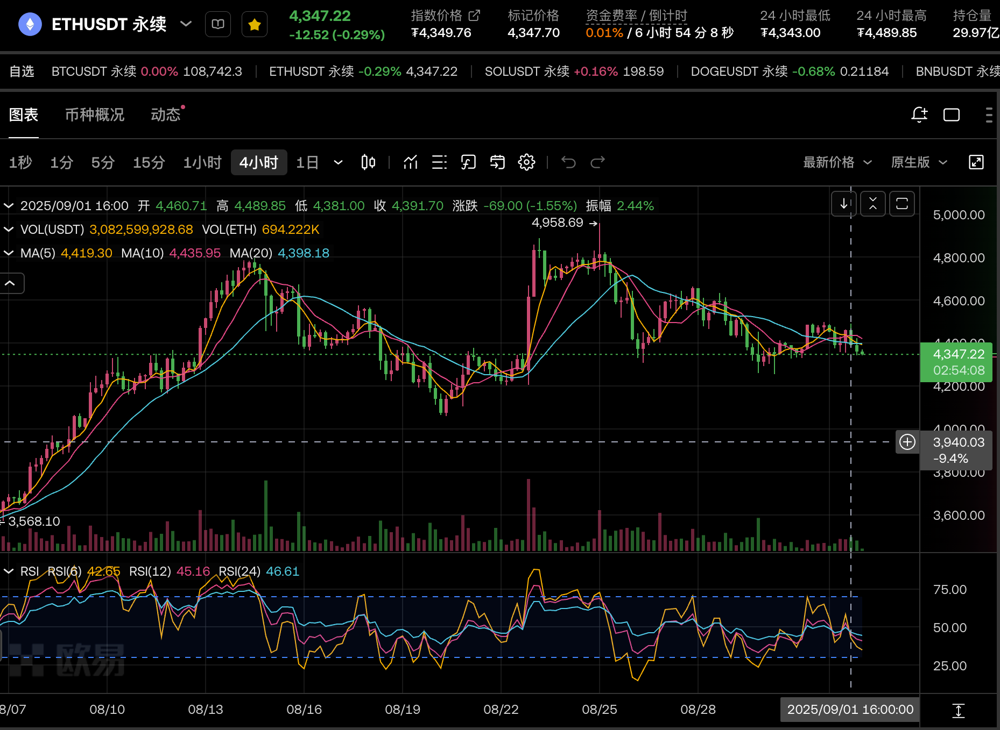
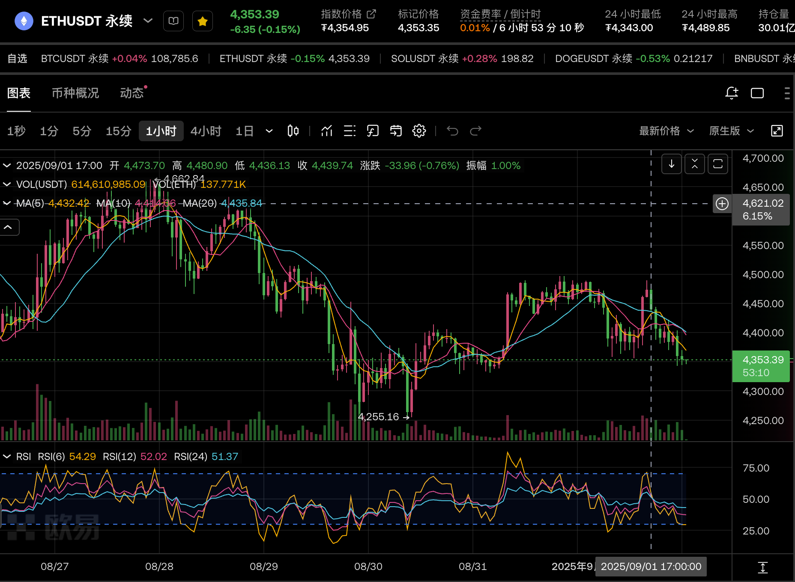
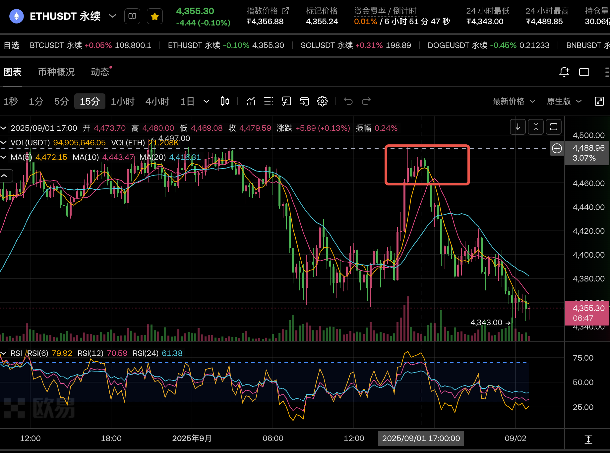

2025-09-01 周一
## 1. 近期是否有大事？
今晚美股休盘
## 2. 美股情况如何？
上周五【-1.15%】
## 3. 记录行情
ETH在17:15分左右有一个小顶做空机会。
1. ETH大背景

突破5k不成的回调，交易量明显下降，前几天都有1000亿-2000亿的量，交易量是BTC的3倍多。
近日明显缩量，只有几百亿，并且仅为BTC交易的2倍多。虽然热度还是第一，但是资金明显在流失。

2. 今日行情

今日凌晨从4470跌至4356后，在4000上下震荡了几个小时。
15:15开始从4379猛烈拉升至4489，在17:00、17:15之间有两个很平的MA5线，形成小顶。可以开空。
记录一下短时间极速拉升和极速下跌的幅度
- 拉升：4379-4489，涨幅110点，2.5%
- 回调：4470-4390，跌幅80点，1.8%

3. 马后炮再看k线

- 日线：死叉状态
- 4h：刚刚死叉
- 1h：这种急拉看不出什么
- 15min：MA5线平缓，VOL交易量萎缩
- 额外情况，拉升的最后一个15min线，成交量最高，但是形成一个大上影线，这还只是到达4489，更别说4500整数关口的抛压有多大。

## 4. 总结
这种情况有什么好怕的，直接在17:15开空，止盈止损1.5%即可。

大背景回调，成交量缩小，4489上影线，4500整数压力位，4h线刚死叉，MA5线平缓，VOL成交量萎缩。
