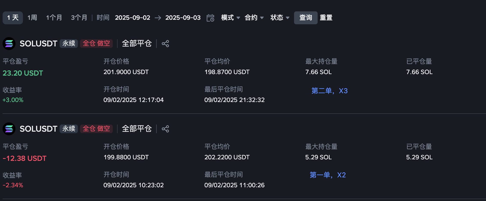

2025-09-02 周二
## 1. 近期是否有大事？
无
## 2. 美股情况如何？
上周五【-1.15%】，昨天休盘。
## 3. 开单记录
第一单没有遵守MA5原则（死叉、平缓、拐点），在15min的MA5持续向上与RSI还是大于70的时候挂单在199.88开空，看到继续上拉，痛定思痛手动止损。

第二单看到15min的MA5线开始平缓与下拐一点点就在201.9开空，其实没有看小时线的MA5与RSI还>60，开单不是很理智，点位不够好，201.9往下200支撑位，往上205也算今日压力位和历史几次压力位，不上不下。
侥幸的是今晚有大跌行情，扛回来了。

第二单的止盈不够果断，在看着价格砸到最低反弹上来，可以看出砸盘已经结束，开始反弹了。

理由是最后一个k线交易量暴涨为原来的两倍多，但是价格没有怎么跌，说明卖盘已经消化完了，买盘开始进场，下影线也能佐证。
1. 20:00-20:15 VOL:231k, -1.42, -0.7%
2. 20:15-20:30 VOL:156k, +0.20, +0.1% 
3. 20:30-20:45 VOL:203k, -1.78, -0.89%
4. 20:45-21:00 VOL:476k, -0.99, -0.5%, 振幅0.84%，有0.34%的下影线

还有一个点位踏空了（第三单）。
在20:45最低点197.23爆拉破今日高点来到205.13，涨幅4%。
在22:45的MA5线开始平缓且微微向下，爆拉之后必有回调。看到的时候价格在204，结合历史的阻力位数据，205是阻力位。
虽然还没有看到小时的MA5线平缓，但是美股【-1.72%】开，结合阻力位可以博一个短空单，止盈止损1.5%。 
如果这样应该会在203.8开空，止损206.85，止盈200.74。
随后的结果是，最低跌到199.66，离开空点位203.8是跌了2%。短空只吃1.5%。
## 4. 总结
从194.06低点拉升到200的时候，涨幅才3%，并且MA5没有变缓，在200限价做空意义不大，因为大概率冲过200继续拉升。果不其然最高能冲到204.38，涨幅5+%，这样的回调概率才大。
201.9仅在MA5线刚开始平缓的时候开空，不是阻力位，而且白天没有夜晚的成交量大，大概率还是得磨一磨横盘，应该在后续的时间里找到更好的点位。