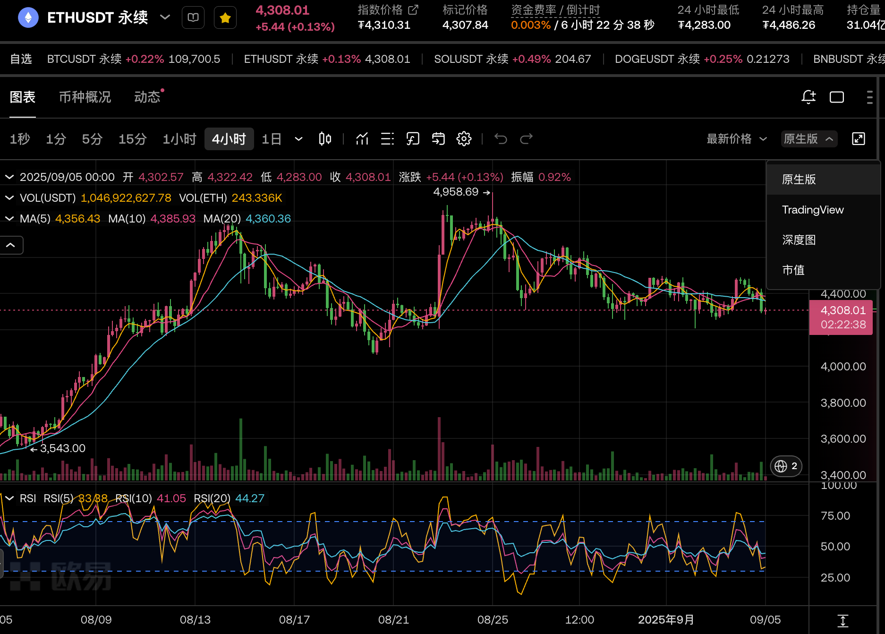

2025-09-03 周三
## 1. 近期是否有大事？
无
## 2. 美股情况如何？
前一天9月2日美股【-1.2%】开，收盘【-0.8%】
## 3. 开单记录
凌晨SOL从200涨到210.35，涨幅5%，15分钟的MA5线在02:15时候第一次平缓，在05:30-06:15的时候第二次平缓。
在8:00-8:30的时候第三次平缓且有下拐迹象，结合210阻力位，我在209.45开空，上下两个点。后续观察走势
- 开始下跌，跌到【207.3】；（符合预期）
- 再次冲高，涨到【211.87】；（稍微反常但是可以接受）
- 开始在【208-211】之间震荡；（符合预期）
- 9月3日美股开盘【+0.8%】；（高开恐慌）
- 最高冲到【212.98】，交易量最高的时候有3个上影线；（极度恐慌）
- 随后开始缓慢下跌，美股收盘【+1.02%】，陆续跌到【208.25】； 
- 9月4日6点有一波小拉升，从【208.25】拉升到【211.84】，没有突破昨晚的前高。
- 9月4日08:15开始缓慢下跌，9点半上班还在横盘。（24小时横盘心态炸裂，想先保本平仓再从210+更好的位置接回来，设置【209.01】止盈）
- 9月4日10:15开始大量下跌至下午低点【205.55】，缓慢拉升回【208.67】后横盘。
- 9月4日美股开盘【+0.2%】
- 截止复盘，最低跌至【203.22】

## 4. 开单总结
肯定自己
1. 210阻力位+MA5第三次平缓开单，思路没有问题。
2. 开单点位也可以，随后的下跌可以佐证，但是突然拉升到211.87属实没有想到。后续即使参考1h、4h的平缓时间开单点位也差不多。
3. 心态修炼还不够，没有坚持初心到最后，2倍杠杆，左右不就4%。

马后炮回顾
1. 前一天以及凌晨的拉升，交易量很大，振幅也较大，会有横盘时间。不着急开单，可以等1h线趋于平缓再开单。
2. BTC拉升+ETH拉升+美股高开高走+3次上涨，组合拳都没有打到2%止损点位，超过24h都在210-212这个阻力位横盘，消耗多头力量，ETH同样横盘很久，没有理由在这个时候放弃，反而应该加仓。

## 5. ETH阻力位横久必跌
4500天然阻力位，无论是15min还是1h线都能看出横盘很久。阻力位横久必跌。

对应2025-08-22行情，SOL在185支撑位横久必涨。

如果没有持仓必开ETH，4460开空，上下2%，止盈4370，止损4551。可以如期在第一波下跌中止盈。

